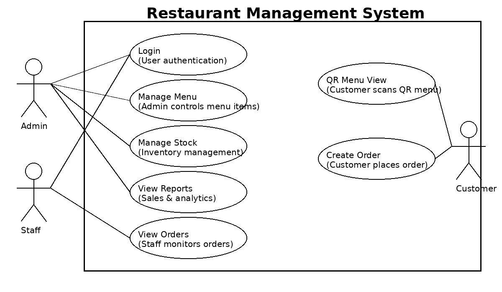

# 🍽 Restaurant Management System

## 1. Executive Summary

The Restaurant Management System is a web-based conceptual software project developed for the Software Project Management course. The project aims to design a scalable, secure, and user-friendly restaurant management platform that digitalizes core restaurant operations such as authentication, menu management, order processing, reporting, and financial analysis.

The project is managed using Agile Scrum methodology with Jira-based sprint planning, UML modeling, and structured academic documentation. The system is currently under active development and follows industry-standard software engineering practices, Agile project lifecycle management, and structured academic documentation.
---

## 2. Product Description and Vision

### 2.1 Problem Definition

Traditional restaurant operations often rely on manual systems, spreadsheets, or disconnected tools that lead to inefficiencies, order errors, and poor data management. Restaurants require an integrated digital system to manage menu, orders, tables, and reports efficiently.

### 2.2 Product Vision

The vision of the Restaurant Management System is to provide a centralized web application that automates restaurant workflows, improves operational efficiency, and enhances decision-making through real-time data and analytics.

### 2.3 Target Users

* Restaurant Administrators
* Restaurant Staff (Waiters/Cashiers)
* Customers (QR Menu View)
* System Managers

---

## 3. Core Features and Capabilities

The system includes the following core features that are currently being implemented and tested:

* Secure User Authentication & Authorization (JWT-based)
* Role-Based Access Control (Admin & Staff)
* Menu & Product Management (CRUD)
* Category and Stock Management
* Order Creation & Order Status Tracking
* Table Management System
* Daily Sales Reporting
* Best-Selling Product Analysis
* Revenue & Profit Calculation
* QR Menu Viewing for Customers

All features are distributed across Agile sprints and tracked via Jira backlog.

---

## 4. Technical Architecture and Infrastructure

### 4.1 System Architecture

The project follows a three-tier web architecture:

* Presentation Layer: React.js Frontend
* Application Layer: Node.js (Express) RESTful API
* Data Layer: MySQL Relational Database

### 4.2 Architectural Model

* Client-Server Architecture
* RESTful API Communication
* Modular Component-Based Frontend (React)
* Scalable Backend Services (Node.js)

### 4.3 Data Flow Overview

1. User logs into the system via secure authentication
2. Backend validates credentials and generates JWT token
3. Role permissions (Admin/Staff) are verified
4. Authorized users access system modules (menu, orders, reports)
5. Data is stored and retrieved securely from MySQL database
6. Reports and analytics are generated dynamically

---

## 5. Technology Stack

### 5.1 Frontend

* React.js

### 5.2 Backend

* Node.js

### 5.3 Database

* MySQL (Relational Database Management System)

### 5.4 Project Management & Documentation Tools

* Jira (Sprint Planning & Backlog Management)
* GitHub (Version Control & Repository Management)
* UML Diagrams (System Modeling)
* Excel (Project Planning, Budget, Timeline)

---

## 6. Security Architecture

Security is a critical design component of the system. The planned security mechanisms include:

* JWT-based authentication and session management
* Secure password hashing using bcrypt
* Role-Based Access Control (RBAC)
* Protected API routes with middleware
* Input validation against injection attacks
* Secure environment variable configuration
* No storage of plain-text passwords

This architecture ensures data confidentiality, integrity, and controlled system access.

---

## 7. Role and Authorization Management Model

The system uses a Role-Based Access Control (RBAC) model:

### Admin

* Full system access
* Manage menu, stock, reports, and users
* View analytics and financial data

### Staff

* Manage orders
* Manage tables
* Access operational features

### Customer

* View QR Menu
* Browse available products and create order

---

## 8. Clearance Level System

A hierarchical access structure is planned:

* Level 1 (Customer): QR Menu View, Create Order
* Level 2 (Staff): View and manage active orders, Manage tables, Access operational features
* Level 3 (Admin): Full System Control (Menu, Reports, Financial Analysis)

This layered model ensures operational security and controlled data access.

---

## 9. User Experience and Interface

The system interface is designed using modern UI/UX principles:

* Responsive web design (Desktop & Tablet compatible)
* Dashboard-oriented interface
* Simple navigation for non-technical staff
* Fast order and table management screens
* QR-based menu access for customers
* Clean and minimal React component design

---

## 10. Installation and Deployment (Planned)

### Development Environment Requirements

* Node.js (v18+)
* MySQL Server
* npm / yarn
* Modern Web Browser (Chrome, Edge, Firefox)

### Planned Setup Steps

1. Clone the GitHub repository
2. Install frontend and backend dependencies
3. Configure environment variables (.env)
4. Set up MySQL database schema
5. Run backend server (Node.js)
6. Run frontend application (React)

Note: The system is currently in the development stage and is being actively implemented. Production deployment has not yet been completed.

---

## 11. Integration and Scalability

The system is being developed with scalability and future integration in mind:

* RESTful API for third-party integrations
* Modular backend architecture
* Scalable MySQL database design
* Cloud deployment compatibility (future scope)
* Multi-branch restaurant support (future enhancement)

---

## 12. Competitive Analysis and Differentiation

| Feature                   | Restaurant Management System | Traditional Restaurant Systems |
|---------------------------|------------------------------|--------------------------------|
| Web-Based Access          | Yes                          | No                             |
| Role-Based Access Control | Yes                          | Limited                        |
| Agile Project Planning    | Yes                          | No                             |
| Integrated Reporting      | Yes                          | Partial                        |
| QR Menu Integration       | Yes                          | No                             |
| Academic Documentation    | Yes                          | No                             |

The project differentiates itself by combining modern web technologies with structured Agile project management practices.

---

## 13. Licensing and Commercial Model

### License

This project is developed as an academic group project for the Software Project Management course and is intended for educational purposes only.

### Future Commercial Potential

The system design can be extended into a commercial SaaS restaurant management platform with:

* Subscription-based model
* Multi-restaurant management
* Advanced analytics dashboard
* Mobile application integration

---

## 14. Technical Requirements

### Server-Side

* Node.js (v18 or higher)
* Express.js
* MySQL Database Server

### Client-Side

* Modern Web Browser (Chrome, Firefox, Edge)
* Internet Connection
* Minimum Resolution: 1366x768

### Development Requirements

* GitHub Repository Access
* Jira Project Board
* UML Documentation
* Excel Planning & Budget Files

---

## 🧩 UML & System Modeling

A Use Case Diagram has been designed to model system interactions between actors and core functionalities.

### Identified Actors

* Admin
* Staff
* Customer

### Main Use Cases

* Login System
* Manage Menu
* Manage Stock
* Create Order
* View Reports
* QR Menu View (Customer)

The UML diagram ensures clear visualization of system scope, user roles, and functional boundaries in accordance with software engineering documentation standards.

### System Use Case Diagram

---

## 👥 Team & Project Context

* Course: Software Project Management
* Project Type: Academic Group Project
* Methodology: Agile Scrum with Jira Tracking
* Team Members:
  - Batuhan İNAN – Backend Developer (Node.js)
  - Emir İnanç ŞEKER – Frontend Developer (React)
  - İzzet Ali ARSLAN – Database & Analytics Developer (MySQL & Reports)
* Application Type: Web-Based System
* Development Stack: React + Node.js + MySQL
* Project Status: Under Development (Implementation Phase)

## 📁 Project Documentation

All project-related academic documents are organized in the `docs/` folder for structured access:

- 📊 Project Planning Document: `docs/Restaurant_Project_Planning.xlsx`
- 🧩 UML Use Case Diagram: `docs/UML_UseCase_RestaurantManagamentSystem.png`

These documents include the 14-week project timeline, sprint planning, team roles, budget planning, and system modeling prepared in accordance with the Software Project Management course requirements.
