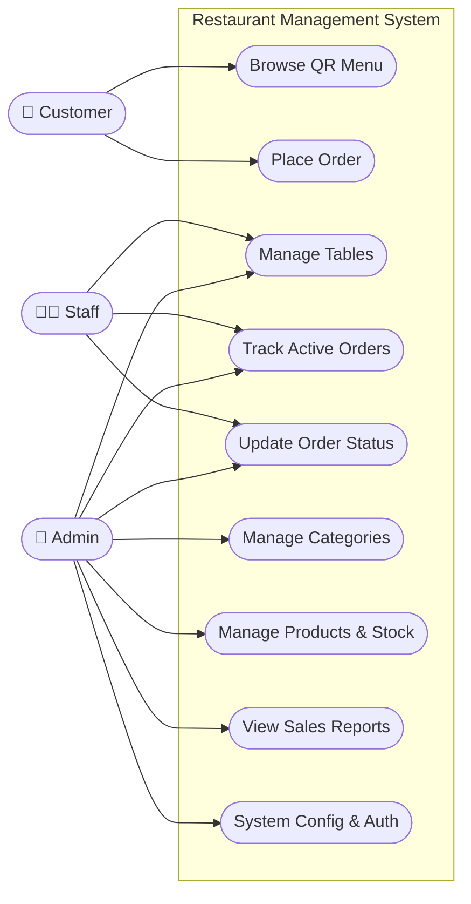

# UML Use Case Diagram

```mermaid
flowchart LR
    %% Actors
    Customer(["👤 Customer"])
    Staff(["🧑‍🍳 Staff"])
    Admin(["👔 Admin"])

    %% System Boundary
    subgraph RMS ["Restaurant Management System"]
        direction TB
        
        %% Customer Use Cases
        UC1(["Browse QR Menu"])
        UC2(["Place Order"])
        
        %% Staff Use Cases
        UC3(["Manage Tables"])
        UC4(["Track Active Orders"])
        UC5(["Update Order Status"])
        
        %% Admin Use Cases
        UC6(["Manage Categories"])
        UC7(["Manage Products & Stock"])
        UC8(["View Sales Reports"])
        UC9(["System Config & Auth"])
    end

    %% Relationships
    Customer --> UC1
    Customer --> UC2

    Staff --> UC3
    Staff --> UC4
    Staff --> UC5

    Admin --> UC3
    Admin --> UC4
    Admin --> UC5
    Admin --> UC6
    Admin --> UC7
    Admin --> UC8
    Admin --> UC9
```
